# Shared timer layout review

These screenshots compare the Neo Brew Timer and COCO Timer layouts after the shared timer extraction. They were captured from production preview builds at a 390 x 844 viewport in English, with animation enabled and sound disabled.

The comparison checks that the timeline, current instruction, countdown, animation preview, and next-step instruction stay inside one main card. COCO keeps its own recipe: 90 C water, 0/40/90/130/165/210 second steps, switch directions, cool-water step, and flavor choice.

## COCO follow-up layout

The setup screen now aligns the bean label with its controls, shows the calculated 1:15 water amount, aligns the flavor label with its choices, and removes the standalone timeline card. Recipe details list only the five brewing steps and show each step duration.

| Setup | Recipe details |
| --- | --- |
| 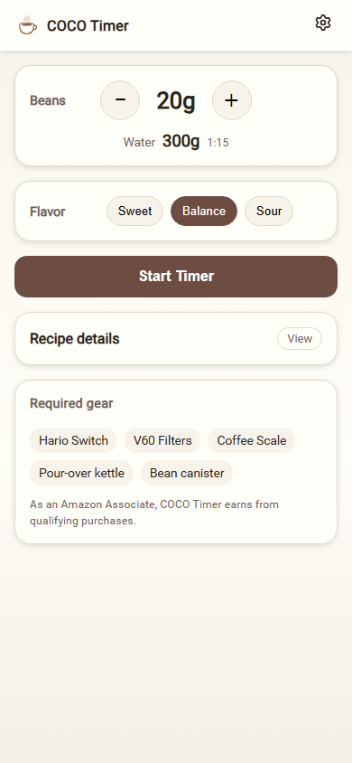 | 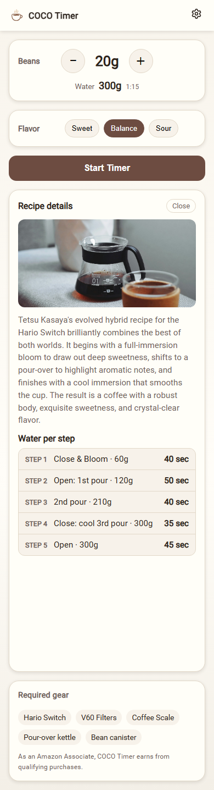 |

The timer header uses bean, water, flavor order. The cool-water instruction is explicitly split into two lines in both the current instruction and animation preview. The taller preview card keeps its label, animation, description, and progress bar separate. The finished card has no step counter or reset button.

| Cool-step preview | Cool step | Finished |
| --- | --- | --- |
| 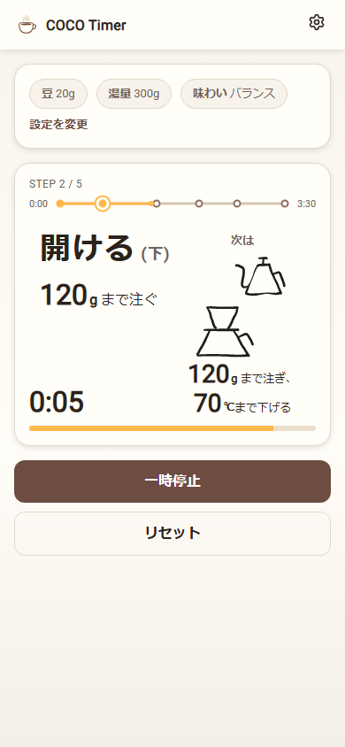 | 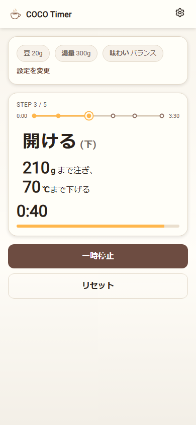 | 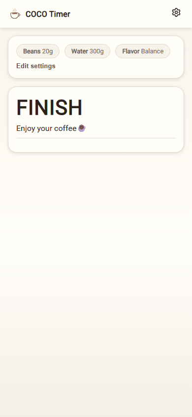 |

| State | Neo Brew Timer | COCO Timer |
| --- | --- | --- |
| Startup preview | 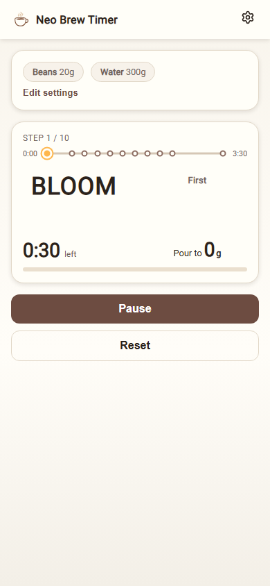 | 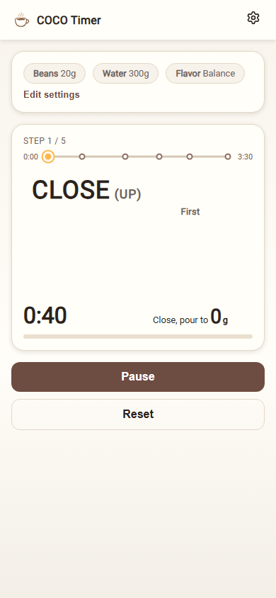 |
| Brewing | 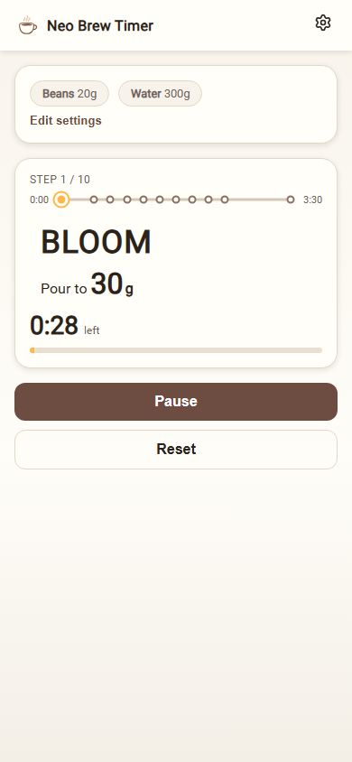 | 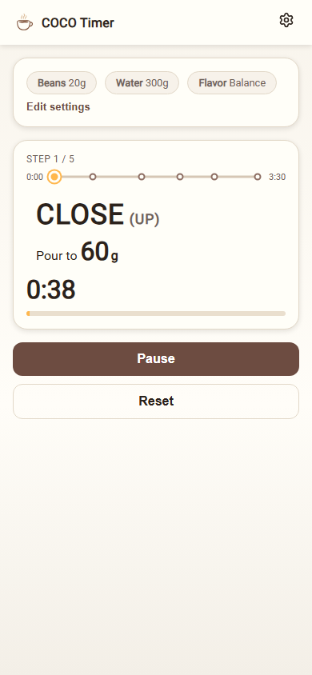 |
| Next-step preview | 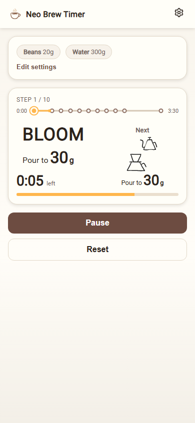 | 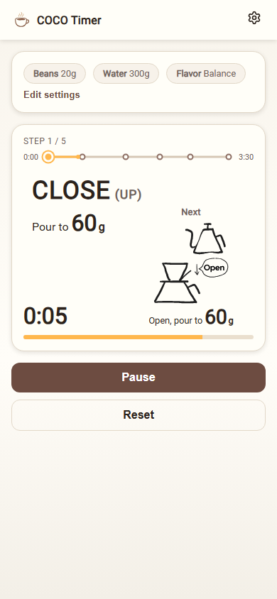 |
| Finished | 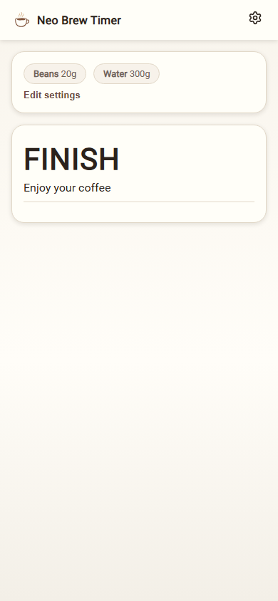 |  |
